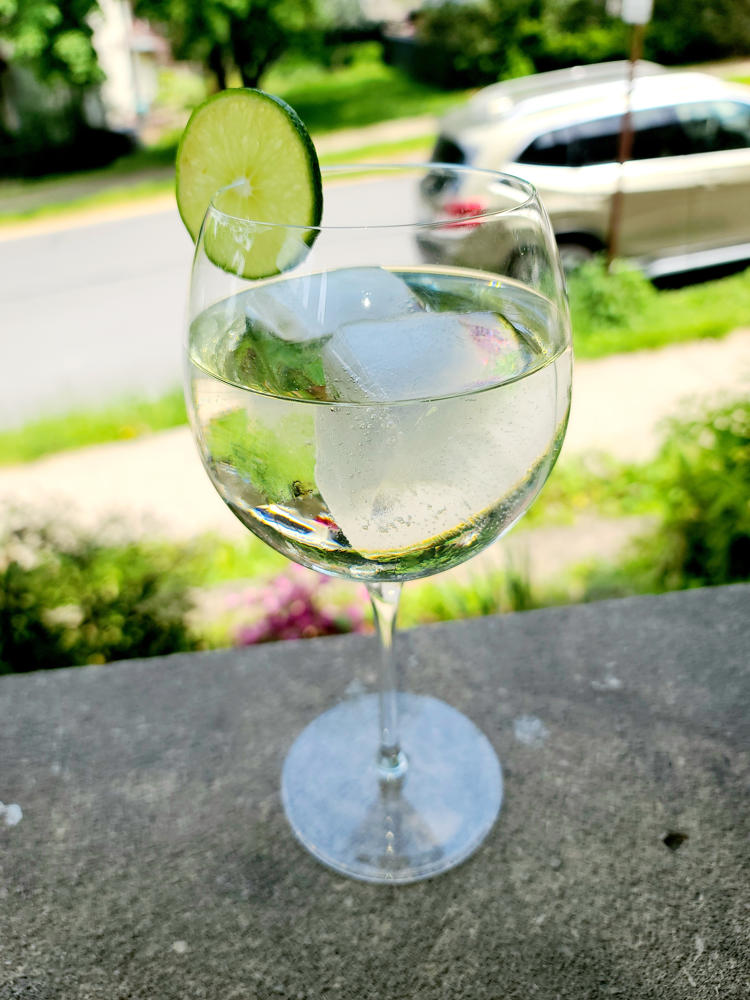

## In the Glass

Quantity | Measure | Ingredient | Notes
-------|------------|--------|----------
4 | oz | White Wine | Sauvignon Blanc or Pinot Grigio
6 | oz | Club Soda | 
4 | dashes | Orange Bitters | "Feegans" or half and half Fee Bros. and Regans.
1 | Wheel | Lime | Garnish

### Method

Build in the glass. Bitters, white wine, then club soda. Let the club soda do the mixing for you. Garnish with the lime wheel.

I prefer this one in a wine glass. A couple of large ice cubes round out the low alcohol mix and add brisk refreshment. You're not looking for a ton of alchohol - and you and a friend could sip away at a bottle of wine all evening this way.