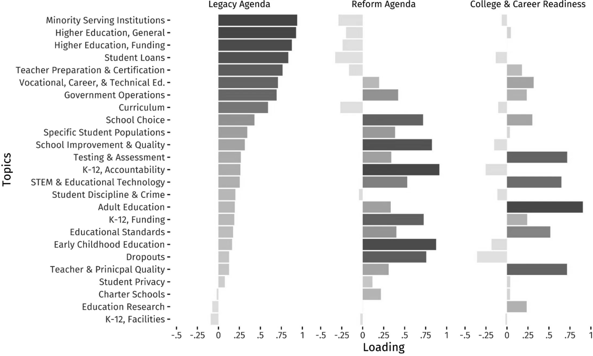

This is a long-term project funded by the National Science Foundation (NSF) in award [#1827494](https://www.nsf.gov/awardsearch/showAward?AWD_ID=1827494&HistoricalAwards=false). With colleagues Deven Carlson, Elizabeth Bell, and Tracy Bark, the project explores how interest groups use research and data in argumentation about education policy. The project is unique in looking at proposed regulations and how groups craft arguments in the proposal development stage.

To do this, we examine a large dataset of public comments on education policies by *paragraph*---over 90k comments. We classify the comments by topic and then examine the use of data and research across topics and groups. The first publication from the project, [Measuring interest group agendas in regulatory proposals](https://doi.org/10.1057/s41309-021-00129-w) is `open-access` and recently appear in *Interest Groups & Advocacy*.