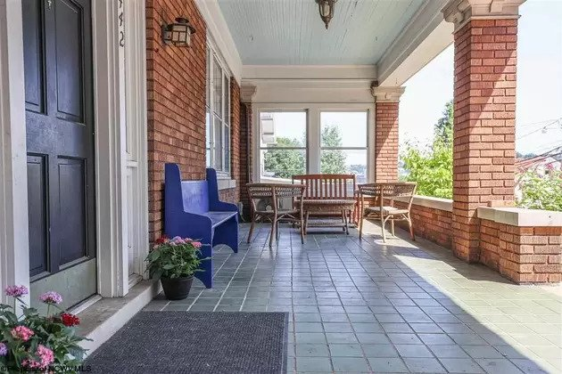
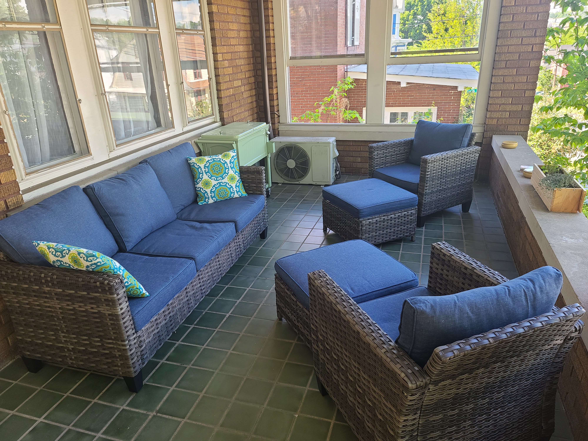

One of the great things about moving back to West Virginia from Oklahoma was the ability to sit on the porch. In Oklahoma, we had a sun room, but it sat low to the ground and wasn't terribly big. In addition, when you live in the south plains, porch time is limited because of the heat that hangs around for a good six months per year.

When I was growing up, my grandfather and his brother were close. His brother lived at the top of steep hill in Edmond, WV. He had an enormous porch and everyone would sit out there talking for hours. Part of the allure of moving back was more time outside (I prefer the cold to the heat any day). When we looked at this house, a huge plus was a giant porch that has a little height to it, especially looking down the street.

Last Sunday, I spent parts of the evening an morning assembling this set of faux wicker furniture from Lowes - a million pieces and really poor tools included (I had to pull out my own to get the job done). Of course, you can't have a porch and not want to have a cool drink on it. So, we ordered a cooler as well. The green and blue work together, I think, and let us move on to plants and other sorts of decoration. This page will be updated until the porch is where we want it. The picture below shows what it looked like when we perused the ad on Realtor. It was pretty sparse and dressed up for sale. The tiles are really slick when wet, so they might have to go eventually as we like it out there even without the sun.

Porch on Realtor

Porch currently
